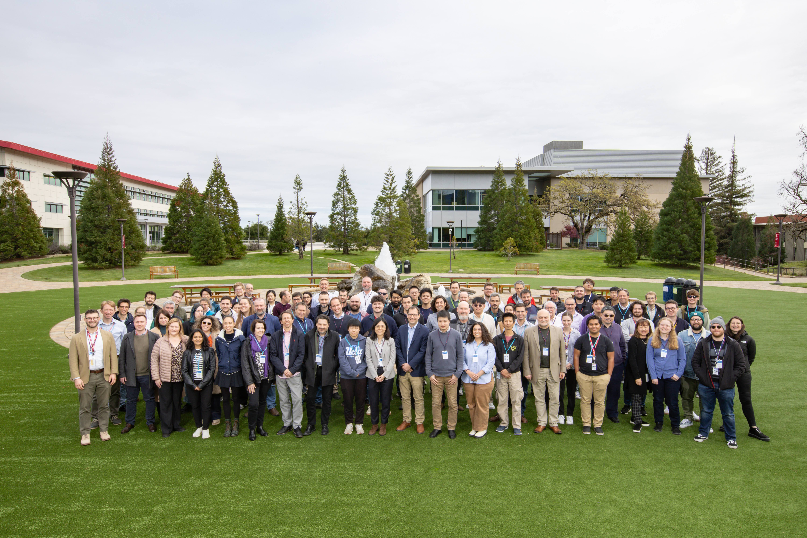

# Events

A summary of upcoming events, as well as past events, that are relevant to this effort.

- [Indico page for 10 TeV Design Study meeting series](https://indico.slac.stanford.edu/category/138/)

- [ALEGRO 2025 Workshop, SLAC](https://indico.slac.stanford.edu/event/9402/)

- [International Workshop on Future Linear Colliders 2025, Valencia](https://agenda.linearcollider.org/event/10594/)

- [ALEGRO 2026 Workshop, INFN Frascati](https://agenda.infn.it/event/47329/overview)

## 2025 ALEGRO Workshop Photo

