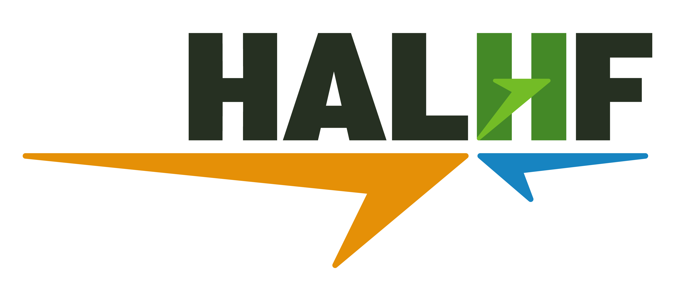
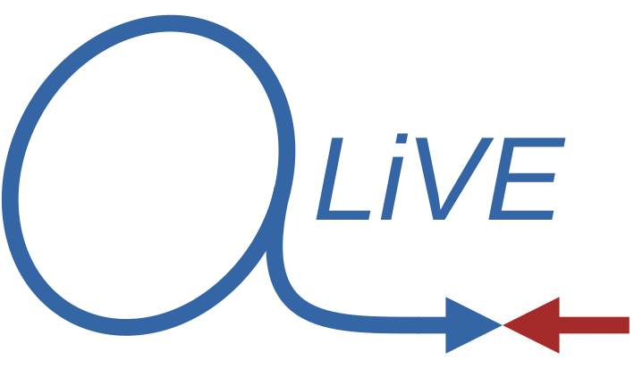
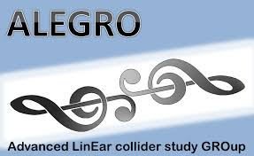
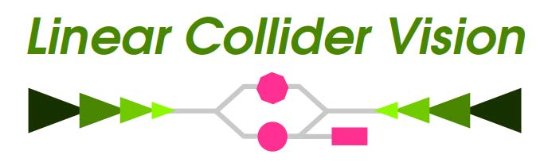

# Collaboration
The 10 TeV Wakefield Collider Design Study is one of several studies aiming to develop a design for future collider based on wakefield technology. There is frequent cross-collaboration between the design studies.

## Partner Studies

### HALHF
{: style="transform: scale(0.5);"}

The HALHF design study is developing a concept for an asymmetric Higgs Factory using beam-driven plasma accelertion to generate high energy electron beams which collide with lower-energy positron beams from an RF accelerator. 

[HALHF Input to ESPPU](https://arxiv.org/abs/2503.23489)

### ALiVE
{: style="transform: scale(0.5);"}

The ALiVE design study is developing a concept for a single-stage, proton beam-driven plasma scheme for accelerating electron and positron beams for a Higgs Factory and other collider concepts. ALiVE is based on technology that is currently being developed by the AWAKE experiment at CERN 

[ALiVE Input to ESPPU](https://arxiv.org/abs/2503.21669v1)

### ALEGRO
{: style="transform: scale(0.99);"}

The ALEGRO study group coordinated collider design efforts across several technologies including beam and laser driven plasma acceleration, and beam and laser driven structure-based acceleration. ALEGRO was created by the ICFA Advanced and Novel Accelerators panel and holds a yearly workshop.

[ALEGRO Input to ESPPU](https://arxiv.org/abs/2504.01434)

### LCVision
{: style="transform: scale(0.5);"}

Linear Collider Vision (LC Vision) brings together proponents and supporters of all kinds of Linear Collider projects, in order to discuss common topics, to develop a united perspective on the long-term evolution of a Linear Collider Facility, and to propose such a facility for CERN.

[LCVision Input to ESPPU](https://arxiv.org/abs/2503.19983)
